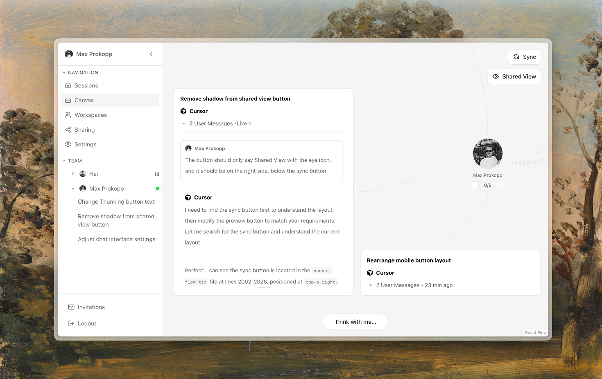
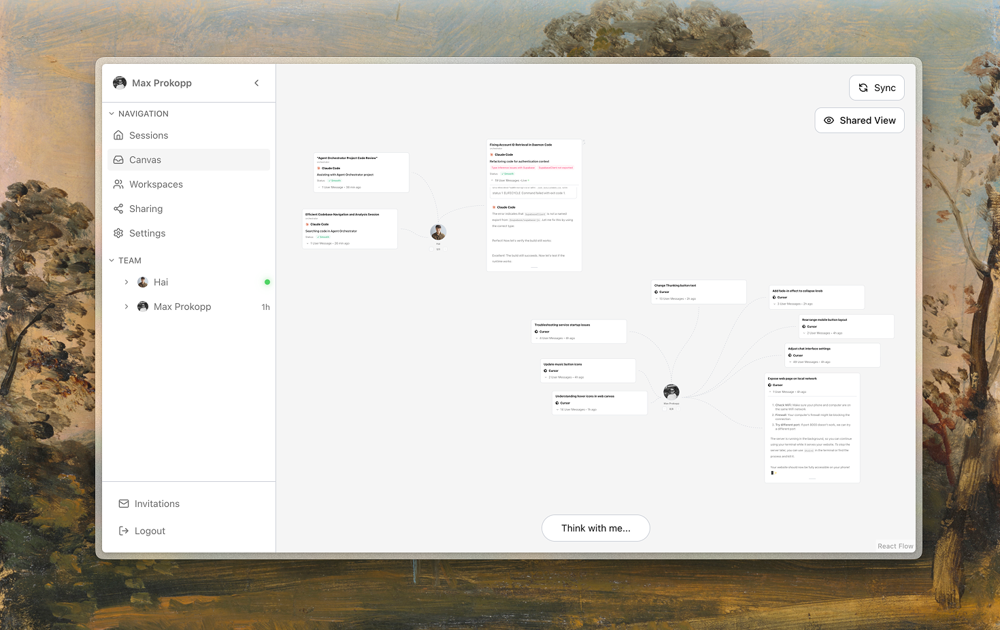
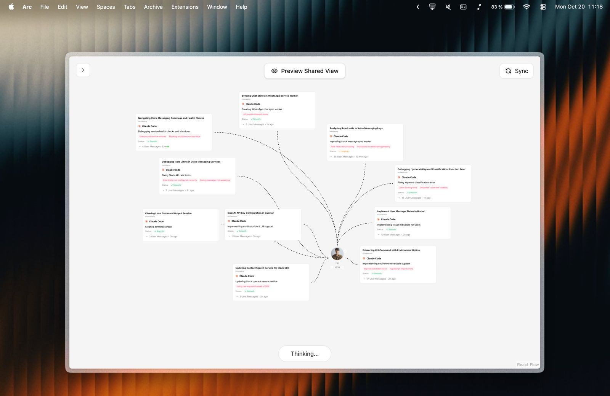
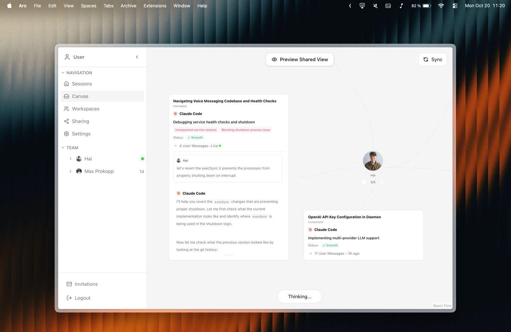
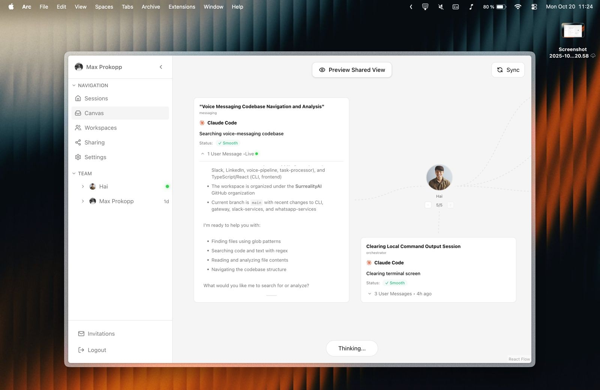
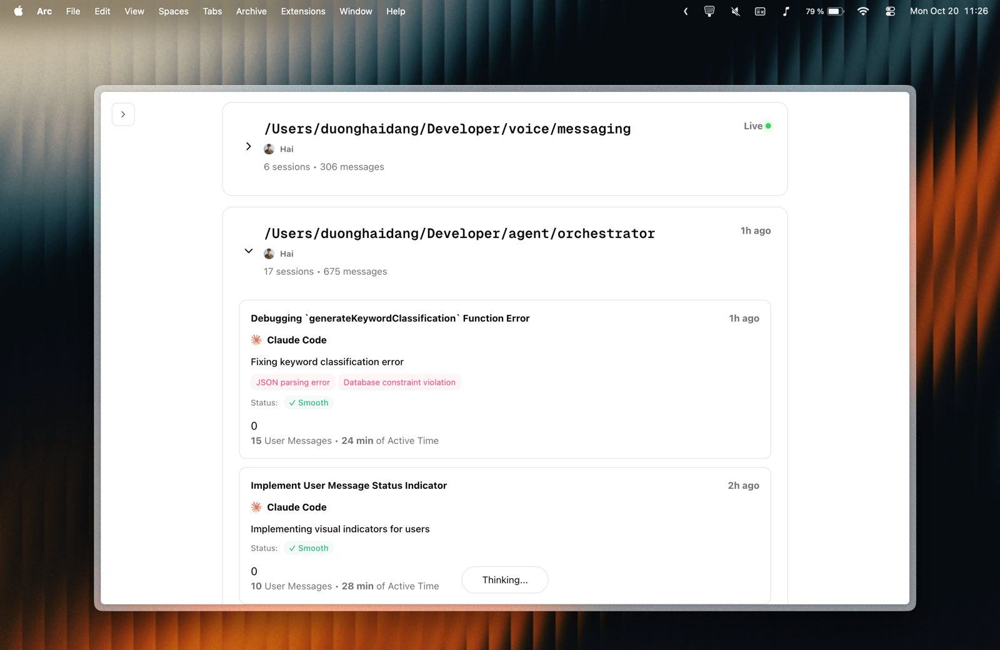

<div align="center">

</div>

**Stay in sync with your team's AI coding sessions — see what they're building in real-time**

When you're deep in flow working with AI agnts, explaining what you're working on is the last thing you want to do. But your teammates need context. Agent Base gives your team transparency into everyone's AI conversations — what they're building, where they're stuck, and when they need help — without interrupting the flow.

<div align="center">


<table border="0">
  <tr>
    <td></td>
    <td></td>
  </tr>
</table>

[](LICENSE)
[](https://github.com/AgentOrchestrator/agent-orchestrator)
[](https://github.com/AgentOrchestrator/agent-orchestrator/commits/main)
[](https://github.com/AgentOrchestrator/agent-orchestrator/graphs/commit-activity)
[](https://github.com/AgentOrchestrator/agent-orchestrator/issues)

[Installation](#-installation) • [Commands](#-available-commands) • [Preview](#-preview) • [Features](#-features) • [Integrations](#-integrations)
</div>


</div>

---

## 🚀 Installation

**Prerequisites:** Node.js 18+

### Get Started

```bash
git clone https://github.com/AgentOrchestrator/agent-orchestrator.git
cd agent-orchestrator

# Using pnpm (recommended - faster and more efficient)
pnpm install
pnpm run setup
pnpm run dev

# OR using npm
npm install
npm run setup
npm run dev
```

Then open **http://localhost:3000** in your browser!

### What the setup wizard does:

The setup wizard (`npm run setup` or `pnpm run setup`) will ask you to choose between:
- **🏠 Local Supabase** - Solo development, testing, or personal use. Runs entirely on your machine.
- **👥 Remote Supabase** - Team collaboration where you can see each other's AI conversations in real-time.

The setup script automatically:
- Installs Supabase CLI (if using local)
- Starts local Supabase or prompts for remote credentials
- Configures environment variables
- Sets up OpenAI API key for AI summaries

### Access points:
- **Web UI**: http://localhost:3000
- **Supabase Studio** (local only): http://localhost:54323

> **Note**: Authentication tokens are cached in `$HOME/.agent-orchestrator/auth.json` for persistent login sessions.

---

### Local vs Remote Supabase

| Feature | 🏠 Local Supabase | 👥 Remote Supabase |
|---------|------------------|-------------------|
| **Use Case** | Solo development, testing | Team collaboration |
| **Setup** | Automatic (via setup script) | Requires [supabase.com](https://supabase.com) project |
| **Data Sharing** | Only on your machine | Shared across team in real-time |
| **Internet Required** | No | Yes |
| **Cost** | Free | Free tier available, paid plans for production |
| **Supabase Studio** | http://localhost:54323 | Via Supabase dashboard |

**For Remote Supabase (Team Setup):**

One team member should:
1. Create a project at [supabase.com](https://supabase.com)
2. Go to Project Settings → Database and run migrations from `supabase/migrations/`
3. Share the project URL and anon key with the team

Each team member then:
1. Clone the repository
2. Run `pnpm install && pnpm run setup` (or `npm install && npm run setup`)
3. Choose "Remote Supabase" and enter the shared credentials

---

### Non-Interactive Setup (for coding assistants or CI/CD)

For automated setups where you can't use the interactive wizard, you must provide Supabase credentials:

**First, get your credentials:**

For local Supabase:
```bash
# Install and start Supabase CLI first
brew install supabase/tap/supabase  # macOS
supabase start
supabase status  # Get URL and anon key
```

For remote Supabase:
- Create project at [supabase.com](https://supabase.com)
- Get credentials from Project Settings → API

**Then run setup:**

```bash
# Using environment variables (recommended)
export SUPABASE_URL=http://127.0.0.1:54321  # or your remote URL
export SUPABASE_ANON_KEY=eyJh...
export OPENAI_API_KEY=sk-xxx  # optional
pnpm run setup --non-interactive

# Using env file (recommended for CI/CD)
pnpm run setup --non-interactive -e .env.production

# Using CLI args (less secure - visible in process list)
pnpm run setup --non-interactive \
  --supabase-url https://xxx.supabase.co \
  --supabase-anon-key eyJh... \
  --openai-key sk-xxx
```

---

## 📋 Available Commands

All commands work with both **pnpm** (recommended) and **npm**. For npm, use `npm run <command>` instead of `pnpm <command>`.

| pnpm command | npm equivalent | Description |
|--------------|----------------|-------------|
| `pnpm install` | `npm install` | Install all dependencies for the monorepo |
| `pnpm run setup` | `npm run setup` | Interactive setup wizard - configures environment and Supabase |
| `pnpm dev` | `npm run dev` | Start all services in development mode (daemon + web with hot reload) |
| `pnpm dev:daemon` | `npm run dev:daemon` | Start only the daemon service in development mode |
| `pnpm dev:web` | `npm run dev:web` | Start only the web interface in development mode |
| `pnpm build` | `npm run build` | Build all apps for production |
| `pnpm start` | `npm run start` | Start all services in production mode (requires build first) |

### Setup Flags

| Flag | Description |
|------|-------------|
| `--non-interactive` | Run setup without prompts (for CI/CD or coding assistants) |
| `--supabase-url <url>` | Supabase URL (required for non-interactive) |
| `--supabase-anon-key <key>` | Supabase anon key (required for non-interactive) |
| `-e, --env-file <path>` | Load environment variables from a file |
| `--openai-key <key>` | OpenAI API key (optional) |
| `--skip-openai` | Skip OpenAI API key setup (development mode) |
| `--help` | Show detailed help for the setup command |

**Example:**
```bash
# Using env file
pnpm run setup --non-interactive -e .env.production

# Using CLI args
pnpm run setup --non-interactive \
  --supabase-url http://127.0.0.1:54321 \
  --supabase-anon-key eyJh... \
  --skip-openai
```

---

## 💡 Why We Built This

**The Problem:** Max and I were hacking on a project together, jumping between features, debugging issues, and exploring new ideas with our AI coding assistants. The hardest part wasn't the code — it was staying aligned on what the other person was currently working on.

When you're in the zone with Claude Code or Cursor, articulating your current task in Slack feels like context-switching hell. "What are you working on?" becomes a difficult question to answer when you're mid-conversation with an AI, exploring multiple approaches, hitting roadblocks, and iterating rapidly.

**The Solution:** We built Agent Base to create transparency without the overhead. Instead of asking teammates to explain what they're doing, we can simply check the canvas:

- **Real-time visibility** - See who's working on what, right now
- **AI-powered summaries** - Instantly understand the context of each conversation without reading entire chat logs
- **Async collaboration** - Help teammates when they're stuck without interrupting their flow
- **Shared context** - Jump into conversations with full context when pair programming or code reviews

This is the tool we wished we had: a way to stay connected with our team's work without breaking the flow state that makes AI-assisted coding so productive.

---

## 📸 Preview

<div align="center">

### The Canvas

<table>
  <tr>
    <td></td>
    <td></td>
  </tr>
  <tr>
    <td></td>
    <td></td>
  </tr>
</table>

</div>

**What you'll see:**
- 👥 Team member activities across Claude Code, Cursor, and more
- 📊 Real-time chat history synced across your team
- 🔍 AI-generated summaries for each conversation
- 📁 Project-based organization for easy navigation
- ⚡ Live updates as your team codes with AI assistants

---

## ✨ Features

- **👥 Team Collaboration** - See what your teammates are working on in real-time with shared Supabase backend
- **🤖 Multi-Agent Support** - Works with Claude Code, Cursor (Windsurf & Codex coming soon)
- **🧠 AI Summaries** - GPT-4o-mini analyzes conversations and identifies key insights
- **📁 Project Organization** - Chat histories grouped by project for easy navigation
- **⚡ Real-time Updates** - Live dashboard updates as teammates code with AI assistants
- **🔒 Secure by Design** - Read-only web UI, all secrets in backend daemon
- **🏠 Flexible Deployment** - Run locally for solo work or use hosted Supabase for team collaboration

---

## 🔌 Integrations

Agent Base connects with your favorite AI coding assistants to provide real-time visibility into your team's development workflow.

### Supported AI Coding Assistants:

| Integration | Status | Description |
| ----------- | ------ | ----------- |
| [Claude Code](https://claude.ai/claude-code) | ✅ Supported | Anthropic's AI coding assistant - full integration with chat history tracking and real-time updates |
| [Cursor](https://cursor.sh) | ✅ Supported | AI-first code editor - tracks conversations and project context |
| [Windsurf](https://codeium.com/windsurf) | 🚧 Coming Soon | Codeium's AI coding assistant - integration in development |
| [Codex](https://openai.com/blog/openai-codex) | 🚧 Coming Soon | OpenAI's code generation model - integration planned |

### Integration Features:

| Feature | Claude Code | Cursor | Windsurf | Codex |
| ------- | ----------- | ------ | -------- | ----- |
| Chat History Sync | ✅ | ✅ | 🚧 | 🚧 |
| Real-time Updates | ✅ | ✅ | 🚧 | 🚧 |
| AI Summaries | ✅ | ✅ | 🚧 | 🚧 |
| Project Detection | ✅ | ✅ | 🚧 | 🚧 |
| File Change Tracking | 🚧  | 🚧 | 🚧 | 🚧 |

**Legend:**
- ✅ Fully supported
- 🚧 Coming soon
- ⏸️ Planned

Want to see your favorite AI assistant integrated? [Open an issue](https://github.com/AgentOrchestrator/agent-orchestrator/issues) or contribute via PR!

---

## ⚠️ Early Stage Project

**Note:** We recently started building this project and it's in active development. Expect things to move fast, break occasionally, and evolve rapidly. We welcome contributions, feedback, and ideas as we shape the future of team collaboration for AI-assisted coding!

---

## 🤝 Contributing

Contributions welcome! This is a monorepo, so all code lives in one place:
- **Backend (daemon)**: `apps/daemon/`
- **Frontend (web)**: `apps/web/`
- **CLI**: `apps/cli/`
- **Shared code**: `packages/shared/`

Please open an issue or PR in this repository!

---

<div align="center">

Made with ❤️ from Munich and Palo Alto

</div>
