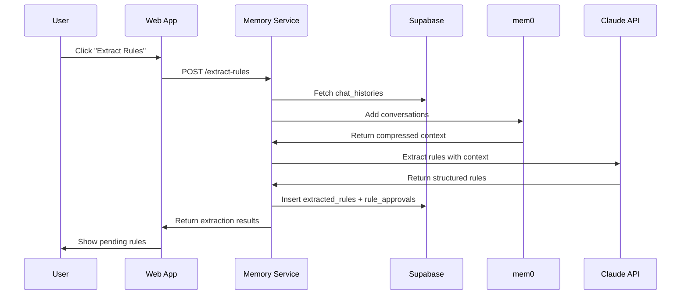
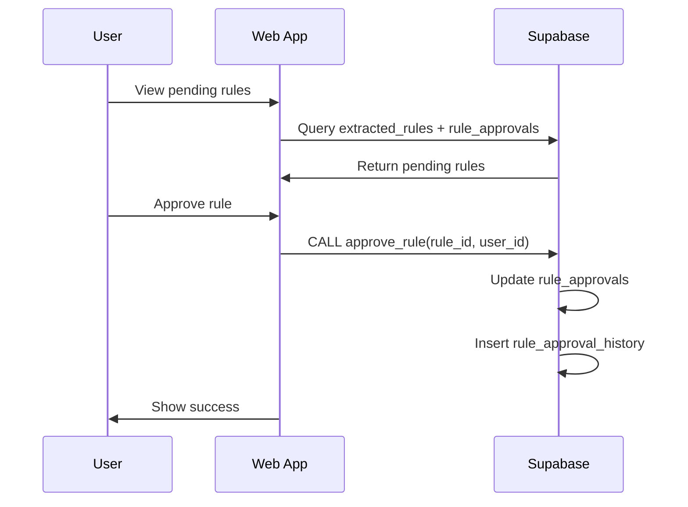
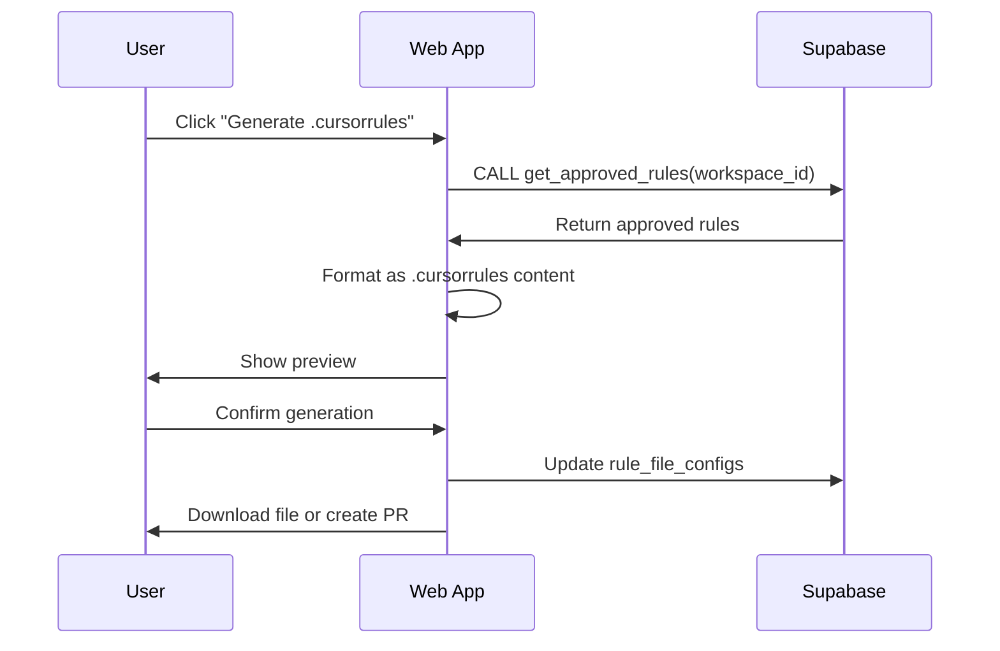

# Shared Memory System - Implementation Documentation

## Overview

The Shared Memory system automatically extracts coding rules, patterns, and conventions from chat histories using **mem0** for intelligent processing of long conversations. Rules are stored with a flexible approval workflow and can be used to automatically maintain rule files like `.cursorrules` and `CLAUDE.md`.

### Key Features

- **mem0 Integration**: 90% token reduction when processing long conversations
- **Flexible Approval Workflow**: Separate approval table supports multi-step, role-based authorization
- **Database-Stored Prompts**: Modify extraction logic without code deployments
- **Audit Trail**: Complete history of all approval decisions
- **Workspace Isolation**: Rules can be scoped to workspaces or projects

---

## Architecture

```
┌─────────────────────────────────────────────────────┐
│              Next.js Web App                        │
│  - Rule approval dashboard                          │
│  - Trigger extraction                               │
│  - Generate .cursorrules files                      │
└────────────────┬────────────────────────────────────┘
                 │ HTTP API
                 ▼
┌─────────────────────────────────────────────────────┐
│         Memory Service (Python + FastAPI)           │
│                                                     │
│  ┌──────────────────────────────────────────────┐  │
│  │      SharedMemoryProcessor                   │  │
│  │  1. Add conversations to mem0                │  │
│  │  2. Search for similar patterns              │  │
│  │  3. Extract rules with Claude                │  │
│  └──────────────────────────────────────────────┘  │
└────────┬──────────────────────────┬─────────────────┘
         │                          │
         ▼                          ▼
┌──────────────────┐      ┌─────────────────────┐
│      mem0        │      │   Supabase Postgres │
│  Memory Layer    │      │   - extracted_rules │
│  - Compression   │      │   - rule_approvals  │
│  - Search        │      │   - approvals_hist  │
└──────────────────┘      └─────────────────────┘
```

---

## Database Schema

### Core Tables

#### 1. `extracted_rules` (Core Rule Data)

Stores the actual rule text and metadata.

```sql
CREATE TABLE extracted_rules (
  id UUID PRIMARY KEY DEFAULT gen_random_uuid(),
  rule_text TEXT NOT NULL,
  rule_category TEXT, -- 'git-workflow', 'code-style', 'architecture', etc.
  source_session_ids UUID[] NOT NULL,
  mem0_memory_id TEXT,
  confidence_score FLOAT CHECK (confidence_score >= 0 AND confidence_score <= 1),
  usage_count INTEGER DEFAULT 0,
  last_used_at TIMESTAMPTZ,
  workspace_id UUID REFERENCES workspaces(id),
  project_id UUID REFERENCES projects(id),
  extracted_by UUID REFERENCES auth.users(id),
  created_at TIMESTAMPTZ DEFAULT NOW(),
  updated_at TIMESTAMPTZ DEFAULT NOW()
);
```

#### 2. `rule_approvals` (Approval Workflow - Extensible)

Separate table for approval state, enabling complex authorization schemes.

```sql
CREATE TABLE rule_approvals (
  id UUID PRIMARY KEY DEFAULT gen_random_uuid(),
  rule_id UUID NOT NULL REFERENCES extracted_rules(id) ON DELETE CASCADE,
  status TEXT NOT NULL DEFAULT 'pending', -- pending | approved | rejected | needs_revision | archived
  reviewed_by UUID REFERENCES auth.users(id),
  reviewed_at TIMESTAMPTZ,
  rejection_reason TEXT,
  revision_notes TEXT,
  -- Extensibility fields
  required_approvals INTEGER DEFAULT 1,
  current_approvals INTEGER DEFAULT 0,
  required_role TEXT,
  auto_approved BOOLEAN DEFAULT FALSE,
  approval_conditions JSONB,
  created_at TIMESTAMPTZ DEFAULT NOW(),
  updated_at TIMESTAMPTZ DEFAULT NOW(),
  UNIQUE(rule_id)
);
```

**Why Separate Table?**
- Easy to add multi-step approval without changing core schema
- Different workspaces can have different approval requirements
- Full audit trail via `rule_approval_history`
- Supports conditional auto-approval based on confidence/category

#### 3. `rule_approval_history` (Audit Log)

Tracks all status changes for compliance and debugging.

```sql
CREATE TABLE rule_approval_history (
  id UUID PRIMARY KEY DEFAULT gen_random_uuid(),
  rule_id UUID NOT NULL REFERENCES extracted_rules(id) ON DELETE CASCADE,
  previous_status TEXT,
  new_status TEXT NOT NULL,
  changed_by UUID NOT NULL REFERENCES auth.users(id),
  change_reason TEXT,
  created_at TIMESTAMPTZ DEFAULT NOW()
);
```

#### 4. `extraction_prompts` (Modular Prompts)

Store extraction prompts in the database for easy modification without code changes.

```sql
CREATE TABLE extraction_prompts (
  id UUID PRIMARY KEY DEFAULT gen_random_uuid(),
  name TEXT NOT NULL,
  description TEXT,
  prompt_text TEXT NOT NULL,
  version INTEGER NOT NULL DEFAULT 1,
  is_active BOOLEAN DEFAULT TRUE,
  target_categories TEXT[],
  min_confidence FLOAT DEFAULT 0.7,
  created_by UUID REFERENCES auth.users(id),
  workspace_id UUID REFERENCES workspaces(id), -- NULL = global prompt
  created_at TIMESTAMPTZ DEFAULT NOW(),
  updated_at TIMESTAMPTZ DEFAULT NOW(),
  UNIQUE NULLS NOT DISTINCT (name, workspace_id)
);
```

#### 5. `rule_file_configs` (Track Generated Files)

Track when rule files were last generated and their content for diffing.

```sql
CREATE TABLE rule_file_configs (
  id UUID PRIMARY KEY DEFAULT gen_random_uuid(),
  file_path TEXT NOT NULL,
  file_type TEXT NOT NULL CHECK (file_type IN ('cursorrules', 'claude_md', 'custom')),
  last_generated_at TIMESTAMPTZ,
  last_generated_by UUID REFERENCES auth.users(id),
  last_generated_content TEXT,
  workspace_id UUID REFERENCES workspaces(id),
  project_id UUID REFERENCES projects(id),
  auto_sync_enabled BOOLEAN DEFAULT FALSE,
  created_at TIMESTAMPTZ DEFAULT NOW(),
  updated_at TIMESTAMPTZ DEFAULT NOW(),
  UNIQUE NULLS NOT DISTINCT (file_path, workspace_id, project_id)
);
```

### Helper Functions

```sql
-- Get approved rules for a workspace/project
CREATE FUNCTION get_approved_rules(
  p_workspace_id UUID DEFAULT NULL,
  p_project_id UUID DEFAULT NULL,
  p_category TEXT DEFAULT NULL
) RETURNS TABLE (...) AS $$...$$;

-- Approve a rule (with history tracking)
CREATE FUNCTION approve_rule(
  p_rule_id UUID,
  p_reviewed_by UUID,
  p_notes TEXT DEFAULT NULL
) RETURNS VOID AS $$...$$;

-- Reject a rule (with history tracking)
CREATE FUNCTION reject_rule(
  p_rule_id UUID,
  p_reviewed_by UUID,
  p_rejection_reason TEXT
) RETURNS VOID AS $$...$$;
```

---

## Memory Service (Python)

### Location

```
apps/memory-service/
├── src/
│   ├── __init__.py
│   ├── config.py              # Settings from environment
│   ├── memory_processor.py    # SharedMemoryProcessor class
│   └── main.py                # FastAPI server
├── requirements.txt
├── pyproject.toml
├── package.json
├── .env.example
└── README.md
```

### Key Components

#### SharedMemoryProcessor

Processes chat histories using mem0:

```python
class SharedMemoryProcessor:
    async def process_chat_history(
        chat_history_id: str,
        messages: list[dict],
        user_id: str
    ) -> dict:
        # 1. Add to mem0 (automatic compression)
        self.memory.add(messages, user_id=chat_history_id)

        # 2. Search for similar patterns
        similar_memories = self.memory.search(
            query="coding conventions and repeated corrections",
            user_id=user_id,
            limit=10
        )

        # 3. Extract rules using Claude
        rules = await self._extract_rules_with_context(
            messages=messages,
            similar_memories=similar_memories
        )

        return {"rules": rules, ...}
```

#### FastAPI Endpoints

**Health Check:**
```
GET /health
Response: {"status": "healthy", "mem0_mode": "self-hosted"}
```

**Extract Rules:**
```
POST /extract-rules
Body: {
  "chat_history_ids": ["uuid1", "uuid2"],
  "user_id": "user-uuid",
  "prompt_id": "optional-prompt-id"
}
Response: {
  "success": true,
  "rules_count": 3,
  "rules": [
    {
      "rule_text": "Always create migration files before applying changes",
      "category": "best-practices",
      "confidence": 0.95,
      "evidence": "User said: 'NEVER apply migrations directly...'"
    }
  ],
  "chat_histories_processed": 2
}
```

### Running the Service

```bash
# Install dependencies
cd apps/memory-service
pip install -r requirements.txt

# Configure environment
cp .env.example .env
# Edit .env with your credentials

# Start server
python -m src.main
# OR from root: pnpm dev:memory
```

### Environment Variables

```bash
# Required
SUPABASE_URL=https://xxx.supabase.co
SUPABASE_SERVICE_ROLE_KEY=your-service-role-key
ANTHROPIC_API_KEY=your-anthropic-api-key

# Mem0 Configuration
MEM0_MODE=self-hosted  # or 'platform'
MEM0_API_KEY=your-mem0-api-key  # Only if using platform mode

# Service Configuration
SERVICE_PORT=8000
SERVICE_HOST=0.0.0.0
LOG_LEVEL=INFO
```

---

## Integration Flow

### 1. Rule Extraction Flow



### 2. Approval Flow



### 3. Rule File Generation



---

## Queries

### Get Pending Rules

```sql
SELECT
  r.id,
  r.rule_text,
  r.rule_category,
  r.confidence_score,
  r.source_session_ids,
  ra.status,
  ra.required_approvals,
  ra.current_approvals,
  ra.reviewed_by,
  ra.reviewed_at
FROM extracted_rules r
INNER JOIN rule_approvals ra ON r.id = ra.rule_id
WHERE ra.status = 'pending'
  AND r.workspace_id = $1
ORDER BY r.confidence_score DESC;
```

### Approve Rule

```sql
SELECT approve_rule(
  p_rule_id := 'uuid-here',
  p_reviewed_by := 'user-uuid',
  p_notes := 'Looks good'
);
```

### Get Approved Rules for File Generation

```sql
SELECT
  r.rule_text,
  r.rule_category,
  r.confidence_score
FROM extracted_rules r
INNER JOIN rule_approvals ra ON r.id = ra.rule_id
WHERE ra.status = 'approved'
  AND r.workspace_id = $1
ORDER BY r.rule_category, r.confidence_score DESC;
```

---

## Migration Files

- `supabase/migrations/20251027124506_shared_memory_system.sql` - Core tables and helper functions
- `supabase/migrations/20251027124637_shared_memory_rls_policies.sql` - Row Level Security policies

### Applying Migrations

```bash
# Using Supabase MCP tool (preferred)
# Run from Claude Code or via API

# OR manually:
npx supabase db push
```

---

## Next Steps (Phase 2+)

### API Endpoints (Next.js)
- [ ] `POST /api/rules/extract` - Trigger extraction via memory service
- [ ] `GET /api/rules` - List rules with filters (status, category)
- [ ] `PATCH /api/rules/:id/status` - Approve/reject rules
- [ ] `POST /api/rules/sync` - Generate rule files from approved rules

### UI Components
- [ ] Pending rules dashboard
- [ ] Rule approval modal
- [ ] Rule file preview/diff viewer
- [ ] Extraction history timeline

### Automation
- [ ] Scheduled batch processing (daily cron)
- [ ] Email notifications for new pending rules
- [ ] Auto-approve high-confidence rules (optional)
- [ ] Automatic PR creation for rule file updates

---

## Performance Benefits (mem0)

- **90% fewer tokens** compared to full conversation history
- **91% faster** response times
- **26% better accuracy** than OpenAI memory

---

## Open Questions

1. **Mem0 Deployment**: Self-hosted (local storage) or Mem0 Platform (cloud)?
2. **Default Approval Flow**: Single approver or multi-step?
3. **Auto-Approval**: Enable for high-confidence rules (>0.9)?
4. **Privacy**: Require opt-in before analyzing user chats?
